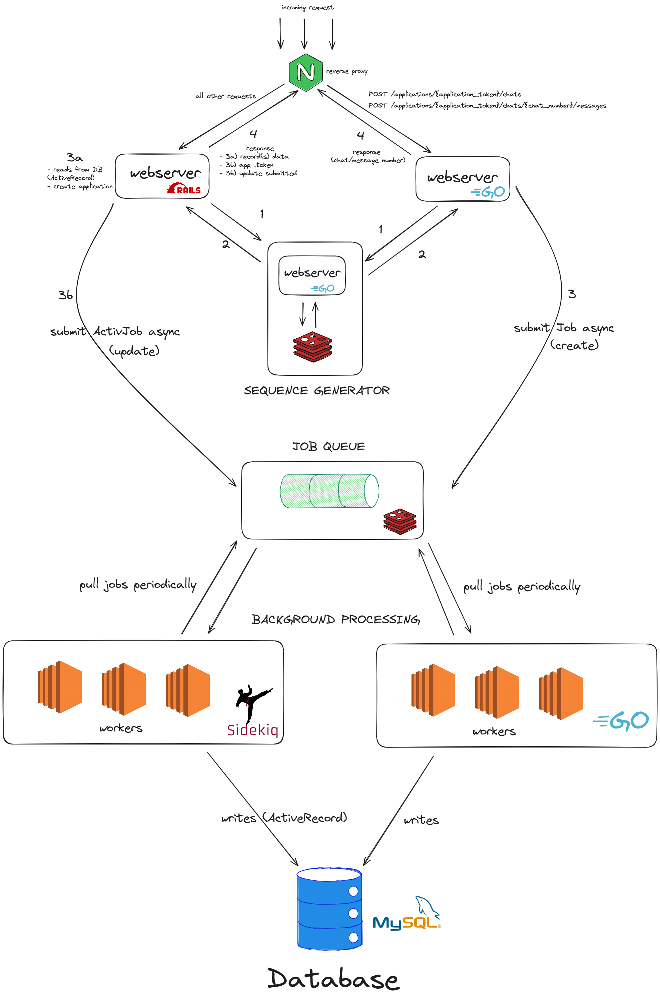

### Architecture Overview



### Environment

To spin up the environment run `docker compose up` (you may need to add a `--build` flag).

If you face errors due to building the images in the compose file, you may run this script:
`./build_and_run.sh`

To generate data you can this command after all containers are running:

```
docker run --rm  --network host -v ./scripts:/scripts -w /scripts python:3.12-slim sh -c "pip install -r requirements.txt && python generate_data.py"
```

### Api Documentation

The API documentation is available at http://localhost:8000/api-docs/
